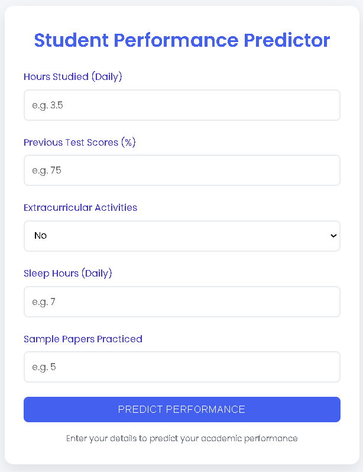
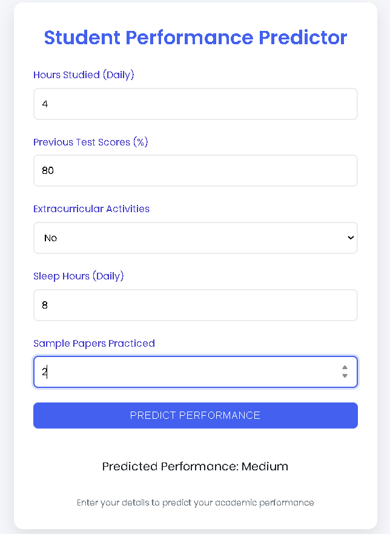
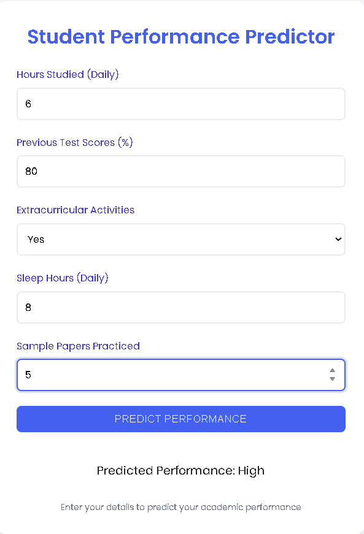

# 🎓 Student Performance Prediction - Flask App

This project is a **Decision Tree Classifier**-based web application that predicts a student's performance category (**Low**, **Medium**, or **High**) based on various input factors.  
The model is trained on a dataset containing features such as study hours, scores, extracurricular activities, sleep hours, and the number of papers published.

---

## 📌 Features
- **Machine Learning Model**: Decision Tree Classifier (`entropy` criterion, max depth 5)
- **Web Framework**: Flask
- **Model Saving**: Pickle
- **User Input**: HTML form with 5 input fields
- **Prediction Output**: Performance Class (`Low`, `Medium`, `High`)

---

## 📂 Project Structure
```
.
├── student_model.py              # Trains and saves the Decision Tree model
├── student_performance_model.pkl # Saved ML model
├── app.py                        # Flask application
├── templates/
│   └── index.html                # Frontend UI for prediction
├── Student_Performance.csv       # Dataset file
├── screenshots/                  # Folder for screenshots
│   ├── home.png
│   └── result.png
└── README.md                     # Project documentation
```

---

## 🛠️ Installation & Setup

1. **Clone the Repository**
```bash
git clone https://github.com/yourusername/student-performance-prediction.git
cd student-performance-prediction
```

2. **Install Dependencies**
Make sure you have Python 3.8+ installed, then run:
```bash
pip install flask scikit-learn pandas numpy
```

3. **Train the Model**
Run the model training script:
```bash
python student_model.py
```

4. **Run the Flask App**
```bash
python app.py
```
The app will run locally at:
```
http://127.0.0.1:5000/
```

---

## 📋 Usage
1. Open the app in your browser.
2. Fill in:
   - **Study Hours**
   - **Scores**
   - **Extracurricular Activities** (Yes/No)
   - **Sleep Hours**
   - **Number of Papers Published**
3. Click **Predict**.
4. See your predicted performance category.

---

## 🖼️ Screenshots
### Home Page


### Prediction Result




---

## 📊 Model Details
- **Algorithm**: Decision Tree Classifier (`entropy`, `max_depth=5`)
- **Target Classes**:
  - `0`: Low Performance
  - `1`: Medium Performance
  - `2`: High Performance
- **Encoding**: Label Encoding for categorical data.

---

## 📜 License
This project is open-source and available under the [MIT License](LICENSE).
